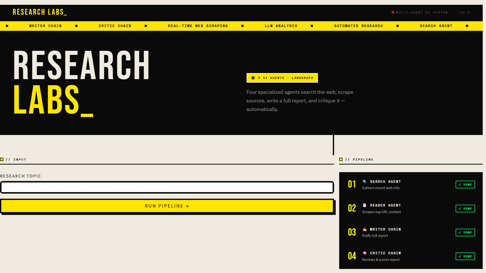

# 🤖 Multi-Agent AI Research System

A complete **Multi-Agent AI Research Pipeline** built using **LangChain + LLMs + Tavily + BeautifulSoup** with a modern **Brutalism UI** and **real-time workflow updates**.

This project demonstrates how multiple AI agents can collaborate together like a real AI team:

- 🔎 Research Agent → Searches the web
- 🌐 Scraper Agent → Extracts website content
- ✍️ Writer Agent → Generates structured report
- 🧠 Critic Agent → Reviews and improves report
- 🤖 Final LLM Agent → Produces polished final output

---
<p align="center">
  
</p>
# 🚀 Features

- Multi-Agent Architecture
- Web Search using Tavily API
- Website Scraping using BeautifulSoup
- LangChain Agent Pipeline
- Writer + Critic AI Chains
- Real-Time UI Updates
- Brutalism Style Interface
- Streaming Final AI Output
- Modular & Scalable Codebase

---

# 📁 Project Structure

```bash
MULTI AGENT/
│
├── .env                # API Keys
├── .gitignore
├── requirements.txt
│
├── agents.py           # All AI agents
├── tools.py            # Tavily + Scraping tools
├── pipeline.py         # Multi-agent workflow orchestration
├── ui.py               # Brutalism UI
│
├── __pycache__/
└── .venv/
```

---

# 🧠 System Architecture

```text
             ┌─────────────────┐
             │   User Query    │
             └────────┬────────┘
                      │
                      ▼
          ┌─────────────────────┐
          │ Research Agent      │
          │ (Tavily Search)     │
          └────────┬────────────┘
                   │
                   ▼
          ┌─────────────────────┐
          │ Scraper Agent       │
          │ (BeautifulSoup)     │
          └────────┬────────────┘
                   │
                   ▼
          ┌─────────────────────┐
          │ Writer Chain        │
          │ Generates Report    │
          └────────┬────────────┘
                   │
                   ▼
          ┌─────────────────────┐
          │ Critic Chain        │
          │ Improves Report     │
          └────────┬────────────┘
                   │
                   ▼
          ┌─────────────────────┐
          │ Final LLM Response  │
          └─────────────────────┘
```

---

# ⚙️ Tech Stack

| Technology | Usage |
|---|---|
| Python | Core Language |
| LangChain | Agent Framework |
| Tavily API | Web Search |
| BeautifulSoup4 | Website Scraping |
| Groq / OpenAI | LLM Backend |
| Streamlit | UI |
| Asyncio | Real-Time Updates |

---

# 📦 Installation

## 1️⃣ Clone Repository

```bash
git clone YOUR_REPO_URL
cd MULTI_AGENT
```

---

## 2️⃣ Create Virtual Environment

### Windows

```bash
python -m venv .venv
.venv\Scripts\activate
```

### Mac/Linux

```bash
python3 -m venv .venv
source .venv/bin/activate
```

---

## 3️⃣ Install Dependencies

```bash
pip install -r requirements.txt
```

---

# 📜 requirements.txt

```txt
langchain
langchain-community
langchain-core
langchain-groq
tavily-python
beautifulsoup4
requests
streamlit
python-dotenv
lxml
```

---

# 🔑 Environment Variables

Create a `.env` file:

```env
GROQ_API_KEY=your_groq_api_key
TAVILY_API_KEY=your_tavily_api_key
```

---

# 🛠️ Building The Project

---

# 1️⃣ tools.py

Contains all external tools:

- Tavily Search Tool
- Website Scraper Tool
- Content Cleaner

Example:

```python
from tavily import TavilyClient
from bs4 import BeautifulSoup
import requests
import os

client = TavilyClient(api_key=os.getenv("TAVILY_API_KEY"))

def search_web(query):
    response = client.search(query=query)
    return response

def scrape_website(url):
    html = requests.get(url).text
    soup = BeautifulSoup(html, "html.parser")
    return soup.get_text()
```

---

# 2️⃣ agents.py

Defines all agents:

- Research Agent
- Writer Chain
- Critic Chain
- Final Response Agent

Example:

```python
from langchain_groq import ChatGroq

llm = ChatGroq(
    model="llama-3.1-8b-instant",
    temperature=0
)
```

---

# 3️⃣ pipeline.py

This file orchestrates the complete workflow.

Pipeline Flow:

```text
User Query
   ↓
Search Web
   ↓
Extract Content
   ↓
Generate Draft
   ↓
Critic Review
   ↓
Final AI Output
```

Example:

```python
def run_pipeline(query):

    research = search_web(query)

    scraped_content = scrape_website(
        research["results"][0]["url"]
    )

    draft = writer_chain.invoke(scraped_content)

    reviewed = critic_chain.invoke(draft)

    return reviewed
```

---

# 4️⃣ ui.py

Creates the frontend using Streamlit.

Features:

- Brutalism Design
- Real-Time Agent Logs
- Streaming Output
- Loading States
- Live Workflow Updates

Run UI:

```bash
streamlit run ui.py
```

---

# 🎨 Brutalism UI Design

UI Characteristics:

- Sharp Borders
- Black & White Theme
- Bold Typography
- Large Buttons
- Raw Minimal Look
- Monospace Fonts

Example CSS:

```python
st.markdown("""
<style>
body {
    background: white;
    color: black;
}

.stButton button {
    border: 4px solid black;
    border-radius: 0;
    font-weight: bold;
}
</style>
""", unsafe_allow_html=True)
```

---

# ⚡ Real-Time Updates

Use Streamlit placeholders:

```python
status = st.empty()

status.write("🔎 Research Agent Searching...")
```

Update dynamically during pipeline execution.

---

# ▶️ Running The Project

Start the UI:

```bash
streamlit run ui.py
```

Open browser:

```text
http://localhost:8501
```

---

# 💡 Example Query

```text
"Explain latest AI agent frameworks and compare them"
```

---

# 🧠 Example Workflow

```text
[Research Agent]
Searching web...

[Scraper Agent]
Extracting article content...

[Writer Agent]
Generating report...

[Critic Agent]
Reviewing report...

[Final Agent]
Producing final response...
```

---

# 🔥 Future Improvements

- Memory-enabled Agents
- Multi-Modal Support
- PDF Report Export
- Voice Input
- Vector Database
- RAG Pipeline
- Autonomous Planning Agents
- Agent-to-Agent Communication
- Tool Calling Router

---

# 🐞 Common Errors

## API Key Error

```text
401 Unauthorized
```

Fix:
- Check `.env`
- Restart terminal

---

## Rate Limit Error

```text
429 Too Many Requests
```

Fix:
- Reduce requests
- Add delay
- Upgrade API plan

---

## Streamlit Not Found

```bash
pip install streamlit
```

---

# 📚 Learning Outcomes

By building this project you will learn:

- Multi-Agent Systems
- AI Workflow Orchestration
- LangChain Pipelines
- LLM Tool Calling
- Web Scraping
- Real-Time AI Applications
- AI UI Engineering
- Prompt Engineering
- Agent Collaboration

---

# ⭐ Recommended Improvements

Add:

- Async Processing
- Redis Queue
- FastAPI Backend
- Docker Deployment
- WebSocket Streaming
- LangGraph
- CrewAI Integration

---

# 📄 License

MIT License

---

# 🙌 Credits

Built using:

- LangChain
- Tavily
- BeautifulSoup
- Streamlit
- Groq/OpenAI APIs

---

# 🚀 Final Result

A fully functional AI research assistant where multiple specialized AI agents collaborate together to:

✅ Search the internet  
✅ Extract knowledge  
✅ Write structured reports  
✅ Critique outputs  
✅ Produce high-quality final answers in real time

---
